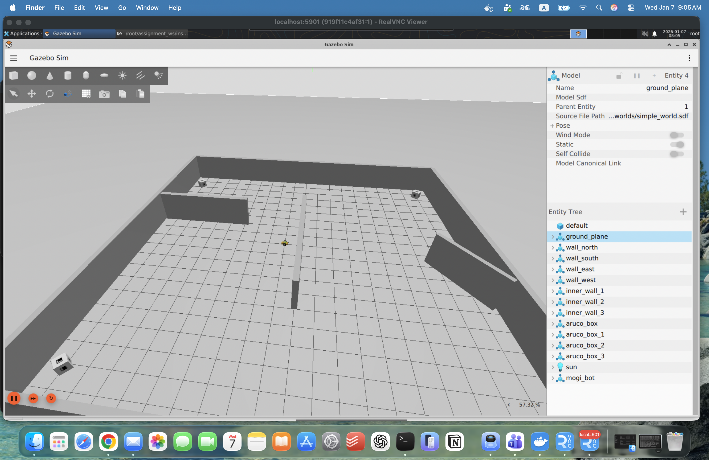
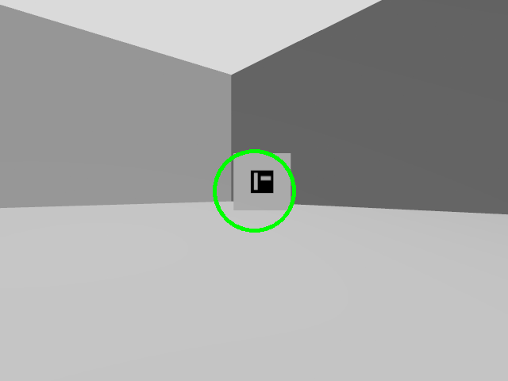
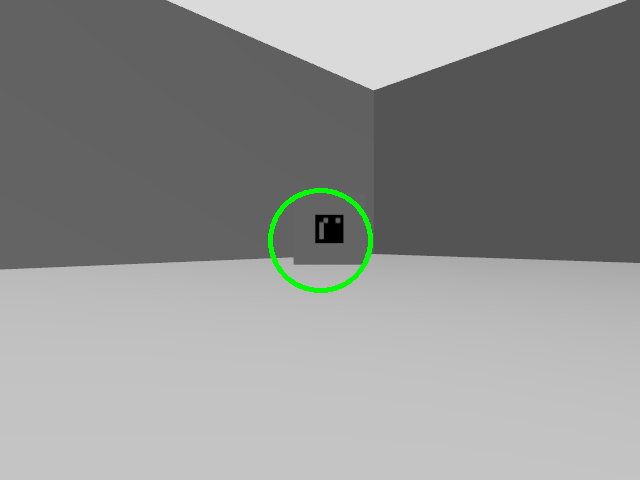
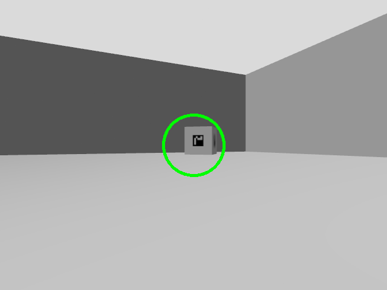
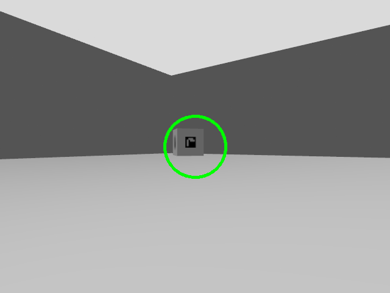

# Assignment 2 — Experimental Robotics Laboratory

**Authors:**  
Gian Marco Balia, Christian Negri Ravera, Francesca Amato, Filippo Salterini, Arian Tavousi, Milad Rabiei

## Table of Contents

- [Overview](#overview)
- [Installation and configuration – bundle workspace](#installation-and-configuration--bundle-workspace)
  - [Prerequisites](#prerequisites)
  - [Husarion robot simulation](#husarion-robot-simulation)
- [Proposed solution](#proposed-solution)
- [PlanSys2](#plansys2)
- [RQT graph](#rqt-graph) 
- [Repository structure](#repository-structure)

## Overview

Developed a ROS2 package that lets a mobile robot endowed with a camera:

- [x] find all markers in the environment;
- [x] implemented the same approach of assignment 1 → the robot goes to the one with the lowest ID, it “takes a picture” modifying the image, it moves to the next one.

There are $4$ waypoints, that the robot can visit to detect each marker:

- $x_1 = -6.0,\space y_1= -6.0$;
- $x_2 = -6.0,\space y_2 = 6.0$;
- $x_3= 6.0,\space y_3 = -6.0$;
- $x_4 = 6.0,\space y_4 = 6.0$.

Implemented the assignment both:

- [x] in simulation (the world file assignment2.world is given);
- [ ] in the real robot.

Assignment requirements:

- [x] Used PlanSys2 to plan the actions of the robot;
- [x] Created one (or more, if needed) ROS2 packages that implement the requested behavior;
- [x] Published the new package on your own repository;
- [x] Created a comprehensive ReadMe;
- [x] Added a video to your ReadMe, showing the behaviour of our code.

## Installation and configuration – bundle workspace

>[!NOTE]
>### Prerequisites
>
>- Ubuntu 22.04 for ROS 2 Humble or Ubuntu 24.04 for ROS 2 Jazzy;
>- Python 3.10 for ROS 2 Humble and Python 3.12.3 for ROS 2 Jazzy;
>- ROS 2 Humble and Jazzy;
>- Gazebo Harmonic;

This assignment is provided as a ready-to-go ROS 2 workspace and uses vcs to import referenced repositories, the correct workflow after cloning should look like this:

```bash
git clone https://github.com/ExpRobLab/assignment2_bundle.git assignment2_ws
cd assignment2_ws
mkdir -p src

sudo apt update
sudo apt install python3-vcstool
```
Import repositories (if the bundle supplies .repos files inside the cloned repo) from within your workspace:

```bash
vcs import src < assignment2_https.repos
```

or with ssh:

```bash
vcs import src < assignment2_ssh.repos
```

Install dependencies:

> [!WARNING]
> The repo references `ros_aruco_opencv` external package. Make sure that package is available in your `src` and that you check-out a branch compatible with your ROS 2 distro if necessary. The package maintainer may have a branch per ROS distro. If using Humble or Jazzy, check out to the matching branch.

```bash
sudo apt-get updateudo apt install -y python3-pip ros-dev-tools ros-$ROS_DISTRO-control-msgs ros-$ROS_DISTRO-control-toolbox\
  ros-$ROS_DISTRO-ros2-control ros-$ROS_DISTRO-ros2-controllers ros-$ROS_DISTRO-joy ros-$ROS_DISTRO-teleop-twist-joy\
  ros-$ROS_DISTRO-moveit ros-$ROS_DISTRO-moveit-ros-planning ros-$ROS_DISTRO-moveit-ros-move-group\
  ros-$ROS_DISTRO-moveit-core ros-$ROS_DISTRO-moveit-plugins ros-$ROS_DISTRO-tf2 ros-$ROS_DISTRO-tf2-ros\
  ros-$ROS_DISTRO-tf2-geometry-msgs ros-$ROS_DISTRO-xacro ros-$ROS_DISTRO-urdf ros-$ROS_DISTRO-moveit-servo\
  ros-$ROS_DISTRO-moveit-msgs ros-$ROS_DISTRO-localization ros-$ROS_DISTRO-plansys2-* ros-$ROS_DISTRO-nav2*\
  ros-$ROS_DISTRO-slam-toolbox ros-$ROS_DISTRO-nav2-bringup ros-$ROS_DISTRO-navigation2

rosdep update
rosdep install --from-paths src --ignore-src -r -y
```

Then build:

```bash
colcon build --symlink-install --packages-up-to assignment2 bme_gazebo_basics worlds_manager aruco_opencv_msgs aruco_opencv ros2_navigation plansys_interface

source install/local_setup.bash
```

### Husarion robot simulation
If you want to use also the simulation of the Husarion Rosbot:

```bash
sudo apt-get update
sudo apt-get install -y python3-pip ros-dev-tools

export HUSARION_ROS_BUILD_TYPE=simulation
vcs import src < src/rosbot_ros/rosbot/rosbot_${HUSARION_ROS_BUILD_TYPE}.repos

export PIP_BREAK_SYSTEM_PACKAGES=1
sudo rosdep init
rosdep update --rosdistro $ROS_DISTRO
rosdep install colcon build --symlink-install --packages-up-to
rosdep install -i --from-path src --rosdistro $ROS_DISTRO -y

colcon build --symlink-install --packages-up-to rosbot --cmake-args -DCMAKE_BUILD_TYPE=Release
```

## Proposed solution

We control a mobile robot in Gazebo to search an environment until all ArUco markers are found and then visit and “capture” each marker in ascending ID order. The behavior is modeled in PDDL and executed using PlanSys2 – a planner generates a valid sequence of actions (e.g., explore → capture), and an executor runs it by activating our ROS 2 “action performer” nodes. Captures are produced by annotating the camera image and saving the final frames to disk, while also publishing the annotated image on a topic.

<p align="center">
  <br>
</p>

The environment contains four ArUco markers whose positions are initially unknown. To ensure a systematic search and prevent endless rotation, we define four exploration waypoints corresponding to the map corners:

- $x_1 = -6.0,\space y_1= -6.0$ → `wp1 = (-6.0, -6.0)`;
- $x_2 = -6.0,\space y_2 = 6.0$ → `wp2 = (-6.0,  6.0)`;
- $x_3= 6.0,\space y_3 = -6.0$ → `wp3 = ( 6.0, -6.0)`;
- $x_4 = 6.0,\space y_4 = 6.0$ → `wp4 = ( 6.0,  6.0)`.

In this solution is proposed a PDDL domain with three actions:

1. **Move to detect action**: The robot navigates through the waypoints, recording the positions of all detected ArUco markers;
2. **Change state action**: The robot sorts the detected markers, removes any duplicates, and selects the lowest marker for each ArUco box;
3. **Move to photograph action**: The robot approaches each selected marker in ascending order of marker ID, centers it, takes a photo, publishes it to the `/camera/image topic`, and saves a copy of the annotated image in the `./assignment2_ws/images/` folder.

### PlanSys2

The ROS2 Planning System offers robotics developers a straightforward and efficient PDDL-based planning framework implemented implemented in ROS2. Its workflow consists of:

- Encoding the task logic in PDDL;
- Letting the planner generate a valid action sequence;
- Implementing each action as a ROS 2 node.

### RQT graph


### Repository structure

```text
assignment2_ws/
├── assignment2_https.repos
├── assignment2_ssh.repos
├── build
├── images
├── install
├── log
├── points_detected
├── README.md
└── src
    ├── assignment2
    │   ├── CMakeLists.txt
    │   ├── launch
    │   ├── package.xml
    │   ├── README.md
    ├── bme_gazebo_basics
    │   ├── action
    │   ├── CMakeLists.txt
    │   ├── config
    │   ├── launch
    │   ├── meshes
    │   ├── package.xml
    │   ├── rviz
    │   ├── urdf
    │   └── worlds
    ├── husarion_components_description
    │   ├── ...
    ├── husarion_controllers
    │   ├── ...
    ├── husarion_gz_worlds
    │   ├── ...
    ├── plansys_interface
    │   ├── CMakeLists.txt
    │   ├── domain
    │   │   ├── domain.pddl
    │   │   └── problem.pddl
    │   ├── launch
    │   │   └── actions_launcher.launch.py
    │   ├── package.xml
    │   ├── README.md
    │   └── src
    │       ├── change_state_action_node.cpp
    │       ├── getplan_and_execute.cpp
    │       ├── getplan.cpp
    │       ├── move_to_detect_action_node.cpp
    │       └── move_to_photograph_action_node.cpp
    ├── ros2_navigation
    │   ├── CMakeLists.txt
    │   ├── config
    │   ├── launch
    │   ├── maps
    │   └── package.xml
    ├── ros_aruco_opencv
    │   ├── aruco_opencv
    │   ├── aruco_opencv_msgs
    │   └── package.xml
    ├── rosbot_ros
    │   ├── ...
    └── worlds_manager
        ├── CMakeLists.txt
        ├── launch
        ├── models
        ├── package.xml
        └── worlds
```

## PDDL model

### Types & objects

- `robot` - single robot
- `marker` - waypoints
- `base` - startnpoint

### Predicates

- `(robot_at ?r - robot ?m - marker)` — tracking robots position
- `(robot_not_at ?r - robot ?m - marker)` — tracking robots position
- `(detected ?m - marker)` — tracking visited ArUco marker's during detect mode
- `(undetected ?m - marker)` — tracking remaining ArUco marker's during detect mode
- `(photo_mode)` — state change after sucessful detections
- `(detect_mode)` — initial state of the robot
- `(photographed ?m - marker)` — tracking photographed ArUco marker's during photo mode
- `(unphotographed ?m - marker)` — final annotated “capture” completed during photo mode
- `(at_base ?r - robot ?b - base)` — position check for state change action
- `(is_base ?b - base ?m - marker)` — marker0 == base
- `(free ?r - robot)` — determining robots status

### Actions

1) `move_to_detect (?r - robot ?m - marker ?m0 - marker ?b - base )`  
   Durative action. Start exploring the waypoint:
   - starts at base and goes to the given waypoint
   - changes marker's status to detected
   - stores the detected marker

2) `change_state (?r - robot ?m1 - marker ?m2 - marker ?m3 - marker ?m4 - marker ?m0 - marker ?b - base)`  
   Durative action. Changes robots state:
   - robot returns to base
   - changes operation mode to "photo_mode"

3) `move_to_photograph (?r - robot ?m - marker)`  
   Durative action. Produces the deliverable output:
   - moves towards determined waypoint
   - centers and takes a photo
   - publish annotated image on a topic
 
---

### Nodes and runtime logic

#### PlanSys2 orchestration
- Domain Expert loads the PDDL domain (actions, predicates, types).
- Problem Expert*holds the current instances + predicates and the goal.
- Planner computes a plan from the domain + current problem.
- Executor dispatches each action in the plan to its corresponding action performer node.

### Action nodes
This project implements three PDDL actions, each backed by a ROS 2 performer node:

- **Move to detect action node**:
  - receives the dispatched action parameters,
  - navigates to the waypoint and performs the search behavior (rotate while waiting for detections),
  - updates the Problem Expert with newly discovered marker,
  - returns success/failure to the PlanSys2 executor after performing the scans.

- **Change state action node**:
  - receives the dispatched action parameters,
  - navigates to the base waypoint,
  - sorts all the ArUco marker's ids,
  - returns success/failure to the PlanSys2 executor.

- **Move to phorograph action node**:
  - receives the dispatched action parameters,
  - navigates to marker and then aligns to the marker,
  - “takes the picture” by annotating the camera frame, publishing it, and saving it to disk,
  - returns success/failure to the PlanSys2 executor.

---

### Topics, TF, and outputs

#### Subscribed topics
- `/camera/image/compressed`
- `/aruco_detections`
- `/tf`

#### Published topics
- `/Nav2`
- `/final_marker_image`

#### Frames
- `odom`
- `base_footprint`
- `camera_link`
- `marker_<id>`

#### Saved artifacts
- `output/marker_<id>.png`

---

### Build & run

#### Build workspace
```bash
mkdir -p ~/assignment_ws/src
cd ~/assignment_ws/src

# clone this repository
git clone https://github.com/ExpRobLab/assignment_planning.git

cd ~/assignment_ws
rosdep install --from-paths src --ignore-src -r -y
colcon build --symlink-install
source install/local_setup.bash
```
#### Launch
**Terminal 1: Gazebo + Robot + Nav2 + Detection + PlanSys2**
```bash
source /opt/ros/$ROS_DISTRO/setup.bash
source ~/assignment_ws/install/setup.bash
ros2 launch assignment2 assignment_2wheels.launch.py world:=simple_world.sdf
```
**Terminal 2: Terminal client**
```bash
source /opt/ros/$ROS_DISTRO/setup.bash
source ~/assignment_ws/install/setup.bash
ros2 run plansys_interface get_plan_and_execute
```
In the second terminal, run `get plan` in order to generate a plan and then run `run` for robot to start.

---

### Results
#### Output images
<p align="center">
  <br>
  <br>
  <br>
  
</p>

#### Video demo
<p align="center">
  
</p>


